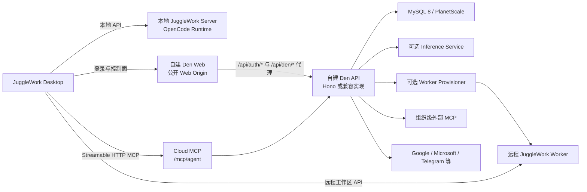

# JuggleWork Cloud 依赖拆解与自建服务端路线图

> 分析范围：JuggleWork Desktop、JuggleWork Server、Den Web、Den API、Den DB、Inference、Worker Runtime
>
> 基线：`feat/jugglework-brand-name` / `e32afff9`
>
> 目标：识别桌面项目对原 OpenWork Cloud 的依赖，并给出可逐模块落地的自建后端顺序

## 1. 先说结论

JuggleWork 的本地核心功能并不依赖 Cloud。以下功能可以完全在本机运行：

- 本地工作区、文件访问和会话
- 本地 JuggleWork Server 与 OpenCode
- 本地技能、Agent、Command、Plugin
- 用户自己配置的模型供应商
- 用户自己配置的本地或远程 MCP
- 本地浏览器、Office 附件和其他桌面扩展

真正依赖 Cloud 的是“跨设备、跨成员、托管运行和集中管理”能力：

- 账号登录、组织、成员和团队
- 云端 MCP 能力入口
- 共享 LLM Provider
- Marketplace、Plugin 和配置对象分发
- 跨会话 Memory Bank
- 托管 Worker / 远程工作区
- 托管模型推理和语音
- 组织级外部 MCP、Google Workspace、Microsoft 365、Telegram
- 账单、套餐、SSO、SCIM、桌面策略、审计与分析

仓库中已经存在一套较完整的服务端实现：

| 组件           | 位置                                          | 作用                                           |
| -------------- | --------------------------------------------- | ---------------------------------------------- |
| Den API        | `ee/apps/den-api`                             | Hono 控制面、认证、组织、MCP、资源、Worker 等  |
| Den Web        | `ee/apps/den-web`                             | Next.js 登录页和组织管理后台，同时代理 Den API |
| Den DB         | `ee/packages/den-db`                          | MySQL/PlanetScale Schema 与 Drizzle 迁移       |
| Inference      | `ee/apps/inference`                           | OpenAI 兼容推理、用量和语音代理                |
| Worker Runtime | `ee/apps/den-worker-runtime`                  | 托管远程工作区运行时                           |
| Docker         | `packaging/docker/docker-compose.den-dev.yml` | MySQL + Den API + Den Web 本地栈               |
| Helm           | `packaging/helm/openwork-ee`                  | Den API、Den Web、可选 Inference 的生产部署    |

因此有两条实施路线：

1. **内部自托管**：部署并裁剪仓库现有 EE 服务，速度最快。
2. **独立重写**：把桌面端调用和协议当作兼容合同，逐模块重新实现。

### 1.1 许可证边界

仓库根目录的大部分代码是 MIT，但 `/ee` 使用 `FSL-1.1-MIT`：

- 内部使用、自托管、非商业研究通常属于许可证明确列出的允许用途。
- 将 EE 代码做成与原产品竞争的商业服务，可能属于许可证所限制的 `Competing Use`。
- 每个版本在发布两周年后获得 MIT future license。

如果目标是对外商业云服务，建议在复用 `/ee` 实现前做正式许可证审查。若要最大程度降低约束，应以桌面客户端调用、公开协议和自行定义的测试为合同，做独立实现，而不是复制 EE 代码。本节只是工程提示，不构成法律意见。

## 2. 当前系统边界



关键约束：

- 桌面端配置的是 **Den Web Origin**，例如 `https://juggle.example.com`。
- 桌面端从该 Origin 派生 API：`<baseUrl>/api/den/v1/...`。
- 登录请求走 `<baseUrl>/api/auth/...`。
- 第一方 Cloud MCP 通常走 `<baseUrl>/api/den/mcp/agent`。
- Den Web 再将 `/api/den/*` 和 `/api/auth/*` 代理到 Den API。
- 不要让桌面端分别维护 Web URL 和 API URL；当前代码已经收敛为一个 Web Origin。

## 3. 桌面端实际调用的最小 Cloud 合同

桌面端主要通过 `apps/app/src/app/lib/den.ts` 访问控制面。与完整 Den API 相比，桌面直接使用的接口集合很小。

| 功能                 | 桌面直接调用                                | 最低优先级           |
| -------------------- | ------------------------------------------- | -------------------- |
| 邮箱登录             | `POST /api/auth/sign-in/email`              | P0                   |
| 邮箱注册             | `POST /api/auth/sign-up/email`              | P0，可在私有部署关闭 |
| 退出                 | `POST /api/auth/sign-out`                   | P0                   |
| 当前用户             | `GET /v1/me`                                | P0                   |
| 设置活动组织         | `POST /v1/me/active-organization`           | P0                   |
| 组织列表             | `GET /v1/me/orgs`                           | P0                   |
| 桌面 Handoff         | `POST /v1/auth/desktop-handoff/exchange`    | P0                   |
| 桌面策略             | `GET /v1/me/desktop-config`                 | P0，初版可返回默认值 |
| 版本信息             | `GET /v1/app-version`                       | P0，初版可返回静态值 |
| 资源快照             | `GET /v1/resources`                         | P1                   |
| 共享 LLM Provider    | `GET /v1/llm-providers`                     | P1                   |
| 获取 Provider 凭据   | `GET /v1/llm-providers/:id/connect`         | P1                   |
| Marketplace 列表     | `GET /v1/marketplaces`                      | P1                   |
| Marketplace 解析结果 | `GET /v1/marketplaces/:id/resolved`         | P1                   |
| Plugin 解析结果      | `GET /v1/plugins/:id/resolved`              | P1                   |
| 组织级 MCP           | `GET /v1/mcp-connections`                   | P1                   |
| 发起 MCP OAuth       | `GET /v1/mcp-connections/:id/connect/start` | P2                   |
| 断开 OAuth Provider  | `POST /v1/oauth-providers/:id/disconnect`   | P2                   |
| MCP Token            | `POST /v1/mcp/token`                        | P1                   |
| Memory 列表          | `GET /v1/memory`                            | P1                   |
| 删除 Memory          | `DELETE /v1/memory/:id`                     | P1                   |
| Worker 列表          | `GET /v1/workers`                           | P2                   |
| Worker Token         | `POST /v1/workers/:id/tokens`               | P2                   |
| Worker 账单          | `GET /v1/workers/billing`                   | P3                   |
| 更新订阅             | `POST /v1/workers/billing/subscription`     | P3                   |
| Telemetry            | `POST /v1/telemetry/ingest`                 | P3，可禁用           |

此外，Cloud Agent 能力还依赖：

| 协议入口                                              | 用途                                          | 最低优先级 |
| ----------------------------------------------------- | --------------------------------------------- | ---------- |
| `POST/GET /mcp/agent`                                 | 对智能体暴露 Cloud 能力                       | P1         |
| `GET /.well-known/oauth-protected-resource/mcp/agent` | RFC 9728 资源发现                             | P1         |
| `/api/auth/oauth2/*`                                  | 第三方 MCP Client 的 OAuth 授权、注册和 Token | P2         |

这张表是“让桌面端逐步可用”的兼容合同，不是完整管理后台 API。

## 4. 模块拆解

优先级定义：

- **P0**：控制面最小闭环，没有它就无法连接自建 Cloud。
- **P1**：形成有价值的团队 Cloud 体验。
- **P2**：托管运行、模型和连接器等增强能力。
- **P3**：商业化、企业治理和运营能力。

工作量是相对估计：S 为数天，M 为约 1–2 周，L 为约 2–4 周，XL 为需要继续拆分的长期模块。估计按单人熟悉 TypeScript 和基础运维计算，不包含安全审计。

### M0. 入口、反向代理与桌面配置

| 项目       | 内容                                                                             |
| ---------- | -------------------------------------------------------------------------------- |
| 优先级     | P0，实施顺序 1                                                                   |
| 工作量     | S                                                                                |
| 要实现     | 一个公开 HTTPS Web Origin；`/api/auth/*`、`/api/den/*` 代理；`/health`、`/ready` |
| 客户端入口 | `apps/app/src/app/lib/den.ts`、`den-endpoint-sources.ts`、`control-plane-url.ts` |
| 可参考实现 | `ee/apps/den-web/app/api/**`                                                     |
| 外部依赖   | DNS、TLS、反向代理或负载均衡                                                     |

验收标准：

- 桌面端只填写一个自建 URL 即可连接。
- `<origin>/api/health` 可用。
- `<origin>/api/den/health` 和 `<origin>/api/den/ready` 可用。
- Cookie、`Authorization`、`Set-Cookie` 和 `X-Request-Id` 能正确透传。
- API 不会重定向到原 `openworklabs.com` 域名。

### M1. 数据库、迁移与密钥

| 项目       | 内容                                     |
| ---------- | ---------------------------------------- |
| 优先级     | P0，实施顺序 2                           |
| 工作量     | M                                        |
| 要实现     | MySQL Schema、迁移、备份、恢复、加密字段 |
| 现有数据层 | `ee/packages/den-db`                     |
| 必需依赖   | MySQL 8 或兼容服务                       |
| 必需密钥   | 认证 Secret、数据库字段加密 Key          |

建议先只建 P0/P1 表，不要第一天复制全部 Schema：

- 用户、Session、Account、Verification
- Organization、Member、Invitation
- DesktopHandoffGrant
- OAuth Client、Access Token、Refresh Token、Consent
- Rate Limit
- 后续再加入 Memory、LLM Provider、Plugin、Marketplace、Worker 等表

现有 Den DB 已有 80 余张表，覆盖完整 Cloud 功能。独立实现时应按模块迁移，避免把 Connector、SCIM、Billing、Telemetry 一次性带入。

验收标准：

- 空库可以一次初始化。
- 后续版本使用可重复执行的 migration。
- Session、Token、Provider Key 等敏感字段不明文落库。
- 有可实际演练的备份恢复流程。

### M2. 认证、Session 与桌面 Handoff

| 项目     | 内容                                                                                           |
| -------- | ---------------------------------------------------------------------------------------------- |
| 优先级   | P0，实施顺序 3                                                                                 |
| 工作量   | L                                                                                              |
| 要实现   | 邮箱登录、Session、Bearer Token、退出、桌面浏览器 Handoff                                      |
| 桌面接口 | `/api/auth/sign-in/email`、`sign-up/email`、`sign-out`、`/v1/me`、`/v1/auth/desktop-handoff/*` |
| 现有实现 | `ee/apps/den-api/src/auth.ts`、`routes/auth/**`、`session.ts`                                  |
| 技术     | 当前项目使用 Better Auth；也可替换，但返回合同必须兼容                                         |

首版建议：

- 使用 `single_org`。
- 关闭公开注册，预置管理员账号。
- 先支持邮箱密码或企业内部 OIDC 其中一种。
- 邮件验证、密码重置、社交登录可以稍后实现。

安全要点：

- Handoff Grant 必须短时、一次性、哈希存储。
- Bearer Session 需要撤销和过期。
- 认证 Origin、Cookie Domain、SameSite、CORS 必须与公开 Web Origin 一致。
- 生产环境必须启用登录限流和失败锁定。

验收标准：

- 用户可以在浏览器登录，并将 Session 安全交给桌面端。
- 重复交换 Handoff Grant 会失败。
- 退出或撤销后桌面请求返回明确的 `401`。
- 桌面能区分“未登录”和“Session 已撤销”。

### M3. 单组织、成员身份与桌面配置

| 项目     | 内容                                                                                    |
| -------- | --------------------------------------------------------------------------------------- |
| 优先级   | P0，实施顺序 4                                                                          |
| 工作量   | M                                                                                       |
| 要实现   | 当前组织、组织列表、活动组织、默认桌面策略、版本信息                                    |
| 桌面接口 | `/v1/me/orgs`、`/v1/me/active-organization`、`/v1/me/desktop-config`、`/v1/app-version` |
| 现有实现 | `routes/me/**`、`routes/org/core.ts`、`routes/version/**`                               |

初版可以大幅简化：

- 只有一个 Organization。
- 所有允许登录的用户自动加入该 Organization。
- `/v1/me/orgs` 永远返回一个组织。
- `/v1/me/desktop-config` 返回允许本地工作区、默认模型策略和品牌信息的静态配置。
- `/v1/app-version` 返回当前桌面版和最低支持版本。

验收标准：

- 登录后桌面不会卡在“选择组织”。
- 活动组织能稳定写入 Session。
- 桌面重启后仍能恢复同一组织。
- 管理员和普通成员至少有明确的权限差异。

### M4. Cloud MCP Token 与 Agent Gateway

| 项目     | 内容                                                    |
| -------- | ------------------------------------------------------- |
| 优先级   | P1，实施顺序 5                                          |
| 工作量   | L                                                       |
| 要实现   | 组织范围 MCP Token、Streamable HTTP MCP、能力搜索和执行 |
| 桌面接口 | `POST /v1/mcp/token`                                    |
| MCP 入口 | `/mcp/agent`                                            |
| 现有实现 | `ee/apps/den-api/src/mcp/**`、`routes/mcp/index.ts`     |

当前 `/mcp/agent` 的重要合同：

- 对 Agent 只暴露 `search_capabilities` 和 `execute_capability` 两个工具。
- `search_capabilities` 返回精确 capability 名称、参数 Schema 和摘要。
- `execute_capability` 只执行搜索返回的能力。
- Token 必须绑定用户、组织、Scope 和 Resource。
- 需要支持 MCP Streamable HTTP。

建议分两步：

1. **M4a 第一方桌面 Token**：只支持已登录桌面通过 `/v1/mcp/token` 获取短期组织 Token。
2. **M4b 公共 OAuth**：再实现 RFC 9728、OAuth Discovery、PKCE、动态 Client Registration 和 Refresh Token。

验收标准：

- 桌面能自动把自建 `/mcp/agent` 写入 OpenCode Runtime Config。
- `tools/list` 只显示两项 Agent Gateway 工具。
- 搜索后可以执行一个只读测试能力。
- Token 换组织后不能访问原组织资源。
- 错误中有可追踪但不泄密的 Reference ID。

### M5. 共享 LLM Provider 与资源快照

| 项目     | 内容                                                                  |
| -------- | --------------------------------------------------------------------- |
| 优先级   | P1，实施顺序 6                                                        |
| 工作量   | M                                                                     |
| 要实现   | 组织级 Provider、加密凭据、模型列表、访问授权、增量资源快照           |
| 桌面接口 | `/v1/llm-providers`、`/v1/llm-providers/:id/connect`、`/v1/resources` |
| 现有实现 | `routes/org/llm-providers.ts`、`routes/org/resources.ts`              |
| 数据表   | LlmProvider、LlmProviderModel、LlmProviderAccess                      |

建议先支持一个 Provider，例如 OpenAI-compatible：

- 管理员保存 Base URL、API Key、模型清单。
- API Key 使用服务端加密 Key 加密。
- 普通成员只能获取其有权限使用的 Provider。
- `/v1/resources` 返回资源版本时间，用于桌面增量同步。

验收标准：

- 管理员创建 Provider 后，获授权成员的桌面可以导入。
- 未授权成员看不到 Provider，也不能通过猜 ID 获取密钥。
- Provider 更新后资源快照时间变化。
- 删除或撤销授权后桌面收到 removed change。

### M6. Plugin、Marketplace 与配置对象分发

| 项目     | 内容                                                                                             |
| -------- | ------------------------------------------------------------------------------------------------ |
| 优先级   | P1，实施顺序 7                                                                                   |
| 工作量   | XL                                                                                               |
| 要实现   | Skill/Agent/Command/MCP 等配置对象、版本、Plugin 聚合、Marketplace、访问授权                     |
| 桌面接口 | `/v1/marketplaces`、`/v1/marketplaces/:id/resolved`、`/v1/plugins/:id/resolved`、`/v1/resources` |
| 现有实现 | `routes/org/plugin-system/**`                                                                    |
| 数据表   | ConfigObject、ConfigObjectVersion、Plugin、Marketplace、各类 Membership/AccessGrant              |

不要一次实现完整 Connector Architecture。建议拆成：

1. M6a：只读 Marketplace + Plugin + Skill 文件。
2. M6b：管理后台创建和更新 ConfigObject。
3. M6c：团队/成员授权。
4. M6d：GitHub 导入和同步。
5. M6e：Connector Instance、Target、Mapping、Sync Event。

验收标准：

- 桌面能列出 Marketplace。
- 解析接口能返回 Plugin 及其文件内容、相对路径、版本。
- 安装后文件只能落到允许的工作区路径。
- 更新和删除能够通过资源快照同步。
- 访问控制在 API 层执行，不能只依赖 Web UI 隐藏。

### M7. Memory Bank

| 项目       | 内容                                           |
| ---------- | ---------------------------------------------- |
| 优先级     | P1，实施顺序 8                                 |
| 工作量     | M                                              |
| 要实现     | Memory 新增、列表、搜索、删除、引用上下文      |
| 桌面接口   | `GET /v1/memory`、`DELETE /v1/memory/:id`      |
| Agent 调用 | 通过 `/mcp/agent` 搜索并执行 Memory capability |
| 现有实现   | `routes/memory/**`、`schema/memory.ts`         |
| 数据依赖   | MySQL Full-text                                |

完整服务端还需要：

- `POST /v1/memory`
- `GET /v1/memory/search`
- 组织、用户或其他 Scope 隔离
- Context/Citation 的脱敏和长度限制

验收标准：

- Agent 在用户确认后可以保存一条 Memory。
- 新会话可以显式搜索到它。
- 不同用户和组织的数据不能串读。
- 删除是幂等的。
- API 对密钥、Token 和敏感 PII 有拒绝或脱敏策略。

### M8. 远程 Worker 与工作区

| 项目     | 内容                                                          |
| -------- | ------------------------------------------------------------- |
| 优先级   | P2，实施顺序 9                                                |
| 工作量   | XL                                                            |
| 要实现   | Worker CRUD、Provisioning、Token、心跳、运行时状态、升级      |
| 桌面接口 | `/v1/workers`、`/v1/workers/:id/tokens`                       |
| 现有实现 | `routes/workers/**`、`src/workers/**`、`den-worker-runtime`   |
| 数据表   | Worker、WorkerInstance、WorkerToken、WorkerBundle、AuditEvent |

现有 Provisioner 支持 `stub`、`render`、`daytona`。自建时推荐顺序：

1. `stub`：连接一台手工部署的固定 Worker，验证 Token 和远程工作区协议。
2. 自建 Docker/Kubernetes Provisioner。
3. 自动创建卷、部署 Worker、探活、回收。
4. 最后再做多租户配额和弹性伸缩。

Worker 需要至少两类 Token：

- Client Token：桌面访问 Worker。
- Host/Owner Token：控制面执行管理操作。

验收标准：

- 控制面创建记录后能获得真实可访问的 Worker URL。
- 桌面通过 Client Token 连接远程工作区。
- Worker 心跳、离线和重连状态准确。
- 删除 Worker 会回收计算实例和持久卷，失败时可重试。
- Host Token 不会返回给普通客户端。

### M9. 托管模型推理与语音

| 项目     | 内容                                                                 |
| -------- | -------------------------------------------------------------------- |
| 优先级   | P2，实施顺序 10                                                      |
| 工作量   | L/XL                                                                 |
| 要实现   | OpenAI-compatible Proxy、Key、模型目录、额度、用量账本、语音 Session |
| 现有实现 | `ee/apps/inference`、`routes/org/inference.ts`                       |
| 数据表   | InferenceKey、LimitPolicy、UsageBucket、Ledger、UpstreamProviderKey  |
| 上游     | 当前可接 OpenRouter 和 OpenAI Realtime，也可替换                     |

如果用户可以自己配置模型 Key，这个模块可以长期不做。只有要提供“平台统一模型额度”时才需要它。

验收标准：

- 每个组织/用户使用独立下游 Key。
- 请求按照模型、Token 或成本正确计量。
- 并发、日限额、月限额在服务端强制执行。
- 上游 Key 不返回桌面端。
- 流式响应和取消请求正常。
- Webhook 重放不会重复计费。

### M10. 组织级外部 MCP 与原生连接器

| 项目       | 内容                                                            |
| ---------- | --------------------------------------------------------------- |
| 优先级     | P2，实施顺序 11                                                 |
| 工作量     | XL                                                              |
| 要实现     | MCP Discovery、OAuth、共享/个人凭据、Tool Catalog、代理调用     |
| 桌面接口   | `/v1/mcp-connections*`、`/v1/oauth-providers*`                  |
| Agent 入口 | `/mcp/agent` 的能力搜索和执行                                   |
| 现有实现   | `routes/org/mcp-connections.ts`、`mcp/external-capabilities.ts` |

建议顺序：

1. 无认证 MCP。
2. API Key MCP。
3. 每成员 OAuth MCP。
4. 组织共享 OAuth MCP。
5. 原生 Google Workspace。
6. Microsoft 365。
7. Telegram。
8. GitHub Connector 同步。

需要防范：

- SSRF：默认拒绝私网、Loopback 和不受信任重定向。
- OAuth Issuer 混淆。
- Token 加密、刷新、撤销。
- Tool Schema 漂移。
- 下游错误不能被误判为 Cloud 登录失效。

验收标准：

- 成员只能使用获授权的连接。
- OAuth State、PKCE、Redirect URI 验证完整。
- 搜索返回真实下游 Tool Schema。
- Tool Call 有超时、请求大小、响应大小和日志脱敏限制。

### M11. 成员、团队、RBAC 与桌面策略

| 项目     | 内容                                                                                     |
| -------- | ---------------------------------------------------------------------------------------- |
| 优先级   | P2/P3，实施顺序 12                                                                       |
| 工作量   | L                                                                                        |
| 要实现   | Invite、Member、Team、Role、资源授权、Desktop Policy                                     |
| 现有实现 | `routes/org/invitations.ts`、`members.ts`、`teams.ts`、`roles.ts`、`desktop-policies.ts` |
| 数据表   | Invitation、Member、Team、TeamMember、OrganizationRole、DesktopPolicy                    |

建议先固定四个角色：

1. owner
2. super-admin
3. admin
4. member

自定义角色可以后置。所有权限必须在 API Middleware 和 Handler 中检查，Web 管理台只负责展示。

验收标准：

- Owner 唯一且不可直接删除。
- Ownership Transfer 是显式操作。
- 普通成员不能通过直接请求管理接口越权。
- Provider、Marketplace、Plugin 和 MCP 授权可以绑定团队或成员。
- 桌面策略能够限制模型、工具或工作区行为。

### M12. Billing、套餐与配额

| 项目     | 内容                                                               |
| -------- | ------------------------------------------------------------------ |
| 优先级   | P3，实施顺序 13                                                    |
| 工作量   | L                                                                  |
| 要实现   | Checkout、Subscription、Webhook、Seat、Usage、Entitlement          |
| 现有实现 | `routes/org/billing.ts`、`routes/workers/billing.ts`、`billing/**` |
| 当前集成 | Stripe 和 Polar；可以替换                                          |

如果只是自用或内部部署，建议：

- 关闭 Billing Gate。
- 所有功能由管理员配置启用。
- 先实现简单配额表，不接支付。

商业化时再接支付，并确保：

- Webhook 验签和幂等。
- 订阅状态不是只由浏览器跳转结果决定。
- Seat 和推理用量的计费口径可追溯。
- 欠费降级不会导致用户数据不可导出。

### M13. SSO、SCIM 与企业治理

| 项目     | 内容                                                                     |
| -------- | ------------------------------------------------------------------------ |
| 优先级   | P3，实施顺序 14                                                          |
| 工作量   | XL                                                                       |
| 要实现   | SAML/OIDC SSO、域名验证、SCIM Users/Groups、JIT、API Key、Audit          |
| 现有实现 | `routes/org/sso.ts`、`routes/org/scim.ts`、`routes/auth/scim.ts`         |
| 数据表   | SsoProvider、SsoConnection、ExternalIdentity、ScimProvider、ScimGroup 等 |

只有明确存在企业客户和身份系统对接需求时再做。实现前需要单独做安全设计和互操作测试。

### M14. 管理后台、Telemetry、诊断、安装链接与品牌资产

| 项目     | 内容                                                                                                     |
| -------- | -------------------------------------------------------------------------------------------------------- |
| 优先级   | P3，实施顺序 15                                                                                          |
| 工作量   | L                                                                                                        |
| 要实现   | Admin API、Analytics、Telemetry、诊断、下载链接、品牌资产                                                |
| 现有实现 | `routes/admin/**`、`routes/telemetry/**`、`egress-diagnostics.ts`、`install-links.ts`、`brand-assets.ts` |

其中：

- `app-version` 和默认 `desktop-config` 属于 P0，应提前做。
- 完整管理分析和 Telemetry 可以后置。
- 自建环境应把默认诊断域名、反馈地址、文档地址和营销跳转改成自己的域名或关闭。

## 5. 推荐实施顺序

### Phase A：可连接的私有控制面

目标：桌面可以连接自建地址、登录，并获得稳定组织上下文。

1. M0 入口与代理
2. M1 数据库和密钥
3. M2 认证与 Handoff
4. M3 单组织与默认配置

完成标志：

- 新安装的 JuggleWork 可以填写自建地址。
- 浏览器登录后桌面显示已登录。
- 重启桌面后 Session 和 Organization 恢复。
- 原 Cloud 下线也不影响该闭环。

### Phase B：第一版有价值的团队 Cloud

目标：团队可以共享模型、技能和 Memory，并让 Agent 调用自建能力。

5. M4 MCP Token 与 Agent Gateway
6. M5 共享 LLM Provider
7. M6a–M6c Marketplace / Plugin / Skill 分发
8. M7 Memory Bank

完成标志：

- Agent 能通过自建 `/mcp/agent` 搜索和执行能力。
- 管理员发布一个共享 Provider 和一个 Skill。
- 成员桌面自动看到并使用这些资源。
- Memory 可以跨新会话搜索。

### Phase C：完整远程工作能力

目标：用户可以从桌面创建或连接远程 JuggleWork Worker。

9. M8 Worker
10. M9 Inference，只有提供托管模型时才做

完成标志：

- 创建、连接、重启、删除 Worker 全链路可用。
- Workspace 数据有持久化、备份和隔离。
- 模型调用不依赖原 Cloud。

### Phase D：连接器与多人治理

11. M10 外部 MCP 和原生连接器
12. M11 团队、RBAC 和桌面策略

### Phase E：商业与企业能力

13. M12 Billing
14. M13 SSO / SCIM
15. M14 Admin / Telemetry / 诊断与品牌管理

## 6. 推荐的第一个可交付版本

不建议第一版实现完整 OpenWork Cloud。建议定义：

### JuggleWork Private Cloud v0.1

- 单组织
- 管理员预置账号
- 邮箱密码登录
- 桌面 Handoff
- 默认桌面配置
- 一个共享 OpenAI-compatible Provider
- 一个只读 Marketplace
- `/mcp/agent` 只包含：
  - `search_capabilities`
  - `execute_capability`
  - Provider/Marketplace/Memory 的最小能力
- Memory Bank
- 不含 Worker 自动创建
- 不含支付
- 不含 SSO/SCIM
- 不含原生 Google/Microsoft/Telegram

这个范围已经能证明最重要的独立性：登录、组织资源、Agent Cloud MCP 和跨会话 Memory 全部由自己的服务提供。

## 7. 技术选型建议

如果沿用项目技术栈：

| 维度          | 建议                                          | 原因                                        |
| ------------- | --------------------------------------------- | ------------------------------------------- |
| 语言          | TypeScript                                    | 与桌面和现有类型一致                        |
| API           | Hono                                          | 当前服务端使用，轻量且 OpenAPI/MCP 集成成熟 |
| Web           | Next.js                                       | 当前 Den Web 已使用                         |
| 数据库        | MySQL 8                                       | 当前 Schema、迁移和全文检索基于 MySQL       |
| ORM           | Drizzle                                       | 当前数据层使用                              |
| Auth          | Better Auth 或兼容实现                        | 当前路由、Session 和 OAuth 基于 Better Auth |
| MCP           | MCP TypeScript SDK + Streamable HTTP          | 与 OpenCode 和桌面现有流程一致              |
| Secret        | KMS/Vault + 应用层 Envelope Encryption        | Provider/MCP/OAuth 凭据需要加密             |
| 部署          | 初期 Docker Compose，生产 Kubernetes/托管容器 | 与现有边界一致                              |
| Observability | JSON Log + OpenTelemetry                      | 可自托管，避免绑定特定厂商                  |

不要在第一阶段拆成微服务。推荐：

- Den Web 一个进程
- Den API 一个模块化单体
- MySQL 一个数据库
- 后台任务先使用数据库队列或单独 Worker 进程
- 只有 Inference 和远程 Worker Runtime 单独部署

## 8. 外部依赖替代清单

| 外部服务              | 当前用途                     | 是否必需 | 自建策略                                     |
| --------------------- | ---------------------------- | -------- | -------------------------------------------- |
| MySQL / PlanetScale   | 控制面数据                   | 必需     | 自建 MySQL 或任意兼容托管 MySQL              |
| Better Auth           | Auth/OAuth/SSO/SCIM          | 库依赖   | 可继续使用或自行兼容                         |
| SMTP / Resend         | 验证、邀请、重置密码         | 可选     | 内部 SMTP；首版关闭邮件验证                  |
| Have I Been Pwned     | 密码泄漏检测                 | 可选     | 隔离环境关闭                                 |
| GitHub/Google OAuth   | 社交登录                     | 可选     | 首版不用                                     |
| GitHub App/API        | Plugin/Marketplace 导入同步  | 可选     | 首版手工上传；后续接 GitHub App              |
| OpenRouter            | 托管模型上游                 | 可选     | 用户自带 Key 或换任意 OpenAI-compatible 上游 |
| OpenAI Realtime       | 语音                         | 可选     | 后置或替换                                   |
| Daytona               | Sandbox Worker               | 可选     | 自建 Docker/Kubernetes Provisioner           |
| Render                | 托管 Worker 部署             | 可选     | 自建容器平台                                 |
| Vercel                | Den Web、Worker DNS          | 可选     | Nginx/Ingress + 自有 DNS                     |
| Stripe / Polar        | 账单与套餐                   | 可选     | 内部部署关闭；商业化时再接                   |
| Google APIs           | Gmail/Calendar/Drive         | 可选     | 模块化接入                                   |
| Microsoft Graph/Entra | Outlook/Calendar/Drive/Teams | 可选     | 模块化接入                                   |
| Telegram Bot API      | Telegram Connector           | 可选     | 模块化接入                                   |
| Loops                 | 营销事件                     | 可选     | 删除或换内部系统                             |
| PostHog               | Web 产品分析                 | 可选     | 清空 Key、自托管或删除                       |
| Sentry                | 错误与追踪                   | 可选     | OpenTelemetry + 自建后端                     |
| OpenWork Diagnostics  | 出站诊断                     | 不应保留 | 改为自己的诊断服务或关闭                     |

## 9. 从原 Cloud 切换到自建域名

优先使用运行时配置，不要先批量替换所有 `openwork` 技术标识。

### 9.1 推荐配置方式

| 场景             | 推荐方式                                          |
| ---------------- | ------------------------------------------------- |
| 自己本机测试     | 在桌面高级设置中填写自建控制面 URL                |
| 给团队分发桌面   | 安装器写入 `desktop-bootstrap.json`               |
| 构建专用桌面版本 | 构建时设置 `VITE_DEN_BASE_URL`                    |
| 自建 Den Web     | 设置 `DEN_API_BASE` 指向自建 Den API              |
| 生成组织安装包   | 设置 `DEN_DESKTOP_DEN_BASE_URL` 和公开 Web Origin |

`desktop-bootstrap.json` 是桌面 Cloud URL 的机器级来源。迁移时需要检查：

- macOS/Linux 常见路径：`~/.config/openwork/desktop-bootstrap.json`
- 旧版 macOS 还可能存在应用数据目录中的同名文件
- 文件中的 `baseUrl` 应为自建 Den Web Origin
- 旧的 Handoff Grant 不应跨机器复制

### 9.2 仍含 Hosted 默认值的运行时代码

以下位置仍将 `app.openworklabs.com` 或 `api.openworklabs.com` 作为默认值或特殊判断。做自有发行版时需要配置化或替换：

| 位置                                                                  | 影响                             |
| --------------------------------------------------------------------- | -------------------------------- |
| `apps/app/src/app/lib/den.ts`                                         | 桌面默认 Den Origin、Hosted 判断 |
| `apps/app/src/app/constants.ts`                                       | Cloud MCP URL 异常时的兜底地址   |
| `apps/desktop/electron/main.mjs`                                      | Electron Bootstrap 默认 Den URL  |
| `apps/desktop/electron/workspace-store.mjs`                           | 工作区/Bootstrap Hosted 识别     |
| `apps/installer/src/install.ts`                                       | 安装器 Hosted 默认 URL           |
| `packages/openwork-bootstrap/bin/openwork.mjs`                        | CLI 默认 API 和 Web URL          |
| `apps/server/src/agent-context-cloud-probe.ts`                        | Cloud MCP 诊断信任 Origin        |
| `apps/server/src/opencode-plugins/openwork-capabilities-knowledge.ts` | Agent 关于 Cloud URL 的知识提示  |

其中 `agent-context-cloud-probe.ts` 默认只信任原 Hosted Origin 和 Loopback。自建 HTTPS Origin 若要通过带凭据的 Cloud MCP 诊断，需要在本地 JuggleWork Server 环境设置：

```text
OPENWORK_AGENT_DIAGNOSTICS_TRUSTED_ORIGINS=https://juggle.example.com
```

这只影响安全诊断探测，不应被用来放宽任意外部 MCP 的 SSRF 策略。

### 9.3 不要因为换域名而改动的兼容标识

除非单独完成迁移设计，否则保留：

- `openwork` 内部 Agent/MCP ID
- `OPENWORK_*` 环境变量
- `openwork://` 协议
- `~/.config/openwork` 配置目录
- `X-OpenWork-*` 兼容 Header
- `@openwork/*` 和 `@openwork-ee/*` Package Name

这些是技术合同，不是面向用户的品牌名称。过早改动会同时破坏旧配置、升级路径、脚本和远程连接。

## 10. 兼容实现必须保持的行为

### 10.1 URL 与代理

- 桌面只保存 Web Origin。
- `/api/den/*` 代理到 API 时保留方法、查询参数、Body 和认证头。
- `Set-Cookie` 不得丢失。
- 公共 URL、OAuth Issuer、MCP Resource URL 必须使用同一套稳定配置。

### 10.2 认证与组织

- Bearer Token、Cookie Session、API Key 是不同 Principal。
- 活动组织是 Session 状态，不能只相信客户端传来的组织 ID。
- `x-openwork-legacy-org-id` 只能作为兼容提示，服务端必须验证成员关系。

### 10.3 MCP

- `/mcp/agent` 使用 Streamable HTTP。
- Resource、Issuer、Audience 必须精确匹配。
- Capability 搜索结果必须携带可验证的参数 Schema。
- 执行层必须重新做权限校验，不能信任 Search 结果。

### 10.4 资源同步

- `/v1/resources` 中的时间或版本必须单调可比较。
- Provider、Marketplace、Plugin 和 ConfigObject 删除需要传播。
- 凭据不得出现在资源快照中。

### 10.5 错误与可观测性

- `401`、`403`、`404`、`409`、`429` 语义稳定。
- 每个请求返回 `X-Request-Id`。
- 日志不得记录 Authorization、Cookie、API Key、OAuth Code 和完整查询 Token。

## 11. 每个阶段的测试门槛

| 阶段    | 最小自动化测试                                          |
| ------- | ------------------------------------------------------- |
| Phase A | 注册/登录/Handoff/重启恢复/撤销/跨组织拒绝              |
| Phase B | MCP Discovery/Token/搜索/执行/资源增删同步/Memory 隔离  |
| Phase C | Worker 创建/探活/Token/持久化/删除回收/故障重试         |
| Phase D | OAuth State/PKCE/Refresh/SSRF/Schema 漂移/RBAC 越权矩阵 |
| Phase E | Webhook 验签与幂等/SSO/SCIM 互操作/审计完整性           |

建议保留一个桌面端端到端 Smoke：

1. 启动自建 Den Web 和 Den API。
2. 新安装或清空配置后的桌面填写自建地址。
3. 登录。
4. 选择组织。
5. 导入共享 Provider 和 Skill。
6. 新建对话。
7. Agent 通过 `/mcp/agent` 执行一项能力。
8. 保存一条 Memory。
9. 新建第二个对话并搜索该 Memory。
10. 断开原 Cloud 网络后重复步骤 3–9。

## 12. 代码导航

| 想了解什么                 | 优先阅读                                                             |
| -------------------------- | -------------------------------------------------------------------- |
| 桌面真正调用哪些 Cloud API | `apps/app/src/app/lib/den.ts`                                        |
| 桌面 Cloud 类型合同        | `apps/app/src/app/lib/den-types.ts`                                  |
| 自定义控制面 URL           | `apps/app/src/react-app/domains/settings/cloud/control-plane-url.ts` |
| 桌面与 Cloud MCP 同步      | `apps/server/src/routes/cloud-mcp.ts`、`cloud-mcp-health.ts`         |
| 完整 API 注册              | `ee/apps/den-api/src/app.ts`                                         |
| OpenAPI                    | 运行 Den API 后访问 `/openapi.json` 或 `/docs`                       |
| Auth                       | `ee/apps/den-api/src/auth.ts`、`src/routes/auth/**`                  |
| Organization               | `ee/apps/den-api/src/routes/org/**`                                  |
| Cloud MCP                  | `ee/apps/den-api/src/mcp/**`                                         |
| Plugin/Marketplace         | `ee/apps/den-api/src/routes/org/plugin-system/**`                    |
| Memory                     | `ee/apps/den-api/src/routes/memory/**`                               |
| Worker                     | `ee/apps/den-api/src/routes/workers/**`、`src/workers/**`            |
| Inference                  | `ee/apps/inference/src/**`                                           |
| DB Schema                  | `ee/packages/den-db/src/schema/**`                                   |
| 本地开发栈                 | `packaging/docker/docker-compose.den-dev.yml`                        |
| 生产部署参考               | `packaging/helm/openwork-ee/**`                                      |
| 自托管说明                 | `packages/docs/start-here/self-host.mdx`                             |
| EE 许可证                  | `ee/LICENSE`                                                         |

## 13. 下一步建议

第一项开发任务应是建立 `Private Cloud v0.1` 的合同测试，而不是先写业务代码：

1. 从 `createDenClient()` 提取 P0/P1 请求与响应 Fixture。
2. 固定错误码、认证头、Organization 选择和 URL 代理规则。
3. 为 `/mcp/agent` 固定初始化、`tools/list`、搜索和执行 Fixture。
4. 用 Mock Server 跑通桌面。
5. 再按 M0 → M4 的顺序把 Mock 逐个替换成真实实现。

这样每完成一个模块，桌面端都会多一段真实可用能力，不需要等完整 Cloud 全部重写完才开始联调。
