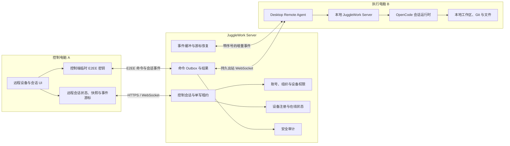

# JuggleWork 跨设备远程会话控制设计

- 状态：设计保留，暂不实施
- 日期：2026-09-18
- 适用仓库：`jugglework-desktop`，并涉及 `jugglework-server`
- 目标：一台安装了 JuggleWork 的电脑，通过 JuggleWork 控制另一台已注册电脑上的既有会话继续执行任务

## 1. 背景

用户可能在办公室电脑上启动一个长任务，离开后希望从另一台电脑查看进展、补充指令、处理审批或停止任务。目标体验参考 Codex 的任务连续性：用户感知上仍在操作同一个任务，但实际执行环境保持明确、可见且可恢复。

本方案定义的是**远程会话控制**，不是远程桌面，也不是工作区迁移：

- 控制电脑只展示远程会话投影并发送受限操作。
- 文件、Git 工作区、模型运行时、工具进程和权限状态始终留在执行电脑。
- JuggleWork Server 负责认证、设备发现、命令转发、事件续传和审计，不代替执行电脑运行任务。
- 控制电脑断开不应中止执行电脑上已开始的任务。

Codex 公开案例中存在“本地开始、移交到云端、同步回来继续”的连续体验。本方案只借鉴任务连续性和执行位置可见性，不复制其本地与云端工作树移交语义。

## 2. 现状基础

当前 Desktop 已具备大部分被控端能力：

- 设备注册、设备签名身份和安全凭据存储。
- Desktop Agent 到控制面的出站 WebSocket、心跳、重连、休眠恢复和撤销处理。
- `workspace.list`、`session.list`、`session.snapshot` 等读取操作。
- `session.create`、`session.prompt`、`session.abort`、`session.pending.cancel` 等修改操作。
- 忙碌会话的 `steer` 和 `enqueue` 能力。
- 权限审批和问题回答；远程权限仅允许“一次允许”或“拒绝”。
- 会话快照、消息/工具/Todo/交互增量事件、事件序号和缺口恢复。
- 修改命令幂等键、载荷哈希、过期时间和命令生命周期。
- P-256 端到端加密载荷与 Ed25519 设备身份签名。
- 后台模式、防休眠、托盘 Stop All 和本地紧急停止。

主要缺口是：

1. JuggleWork Desktop 还没有作为控制端使用的客户端领域层和 UI。
2. 缺少远程设备、远程工作区和远程会话导航。
3. 缺少控制端的 E2EE 会话、事件游标、快照缓存和命令状态协调。
4. 需要在 `jugglework-server` 核实或补齐控制端 API、单写租约、事件保留和审计能力。

## 3. 目标与非目标

### 3.1 P0 目标

- 用户能看到同一账号或组织下已授权的在线设备。
- 用户能浏览目标设备公开的工作区和会话。
- 用户能打开远程会话并实时看到任务输出。
- 用户能向空闲会话继续发送任务。
- 用户能对运行中的会话执行引导、排队、取消排队和停止。
- 用户能处理一次性权限审批和模型问题。
- 控制端断线重连后能从事件游标恢复；无法增量恢复时重新获取快照。
- 所有修改操作可审计、可过期、可去重，并遵守本地优先原则。
- macOS 与 Windows 可以互相控制。

### 3.2 非目标

- 不提供屏幕画面、鼠标或键盘级远程桌面。
- 不同步整个工作区、未提交文件、依赖目录或本地密钥。
- 不允许远程永久扩大执行电脑的权限模式。
- 不保证唤醒已经关机或不具备系统唤醒能力的设备。
- P0 不支持远程附件上传、文件编辑器或终端直连。
- P0 不实现任务从一台电脑迁移到另一台电脑继续执行。

## 4. 核心原则

1. **执行端权威**：会话、运行状态、权限和文件状态以执行电脑为唯一权威源。
2. **服务端只中继**：控制面不能直接访问工作区或替执行端运行工具。
3. **多读单写**：多个控制端可查看，一个会话同一时刻只有一个远程写入租约。
4. **本地优先**：执行电脑本地操作拥有最高优先级，可立即撤销所有远程控制。
5. **断线不中断任务**：控制端离线只影响观察和后续命令，不影响已运行任务。
6. **过期不补执行**：超过 TTL 的远程命令绝不在设备恢复后延迟执行。
7. **显式执行位置**：任何远程页面都必须持续显示目标设备，避免误把命令发到本机。

## 5. 系统架构



执行电脑只建立出站连接，不开放可被外部直接访问的本地端口。

## 6. 用户体验

### 6.1 设备入口

在工作区导航顶部增加执行位置选择器：

```text
本机 ▾
  ✓ 本机 · MacBook Pro
    办公室 Windows · 在线
    家里 Mac mini · 正在执行 1 个任务
    测试电脑 · 离线 · 最后在线 2 小时前
```

切换到远程设备后：

- 左侧展示该设备投影的工作区和会话。
- 页面顶部固定显示“正在控制：设备名”。
- 会话输入框提示“任务将在设备名上执行”。
- 设备离线时输入框只保留草稿，不发送命令。
- 用户可一键返回本机视图。

### 6.2 会话操作

| 会话状态 | 默认动作 |
|---|---|
| 空闲 | 直接发送 `session.prompt` |
| 正在运行 | 选择“立即引导”或“排队执行” |
| 等待审批 | 优先展示审批卡片 |
| 正在停止 | 禁止重复停止，等待终态 |
| 离线 | 保留草稿，提示设备恢复后重新确认发送 |

Stop 操作必须携带 `expectedRunId`，避免用户看到旧运行状态后误停新的运行。

### 6.3 权限交互

远程端只允许：

- 允许一次。
- 拒绝。
- 回答模型问题。

“本会话一直允许”“完全访问”等持久权限只能在执行电脑本地修改。

## 7. 控制会话与并发模型

控制会话分为：

- `view`：只读，可获取列表、快照和事件。
- `control`：包含只读能力并持有远程修改权限。

建议采用多读单写：

- 同一远程会话可以有多个 `view` 控制会话。
- 同一远程会话最多一个有效写入租约。
- 写入租约由控制端心跳续期，断开或超时后自动释放。
- 本地用户操作、Stop All、关闭远程控制、退出账号或设备撤销会立即使租约失效。
- 控制端不得通过重试绕过租约冲突；应展示当前控制者和剩余租约时间。

## 8. 核心流程

### 8.1 建立远程查看

1. 控制端获取账号或组织下的设备列表及在线状态。
2. 用户选择执行设备。
3. 控制端生成临时 P-256 密钥并申请 `view` 控制会话。
4. Server 验证用户、组织、设备和 feature gate。
5. 执行端验证并绑定控制会话，双方建立 E2EE 上下文。
6. 控制端调用 `workspace.list`、`session.list`。
7. 打开目标会话后调用 `session.snapshot`。
8. 从快照对应的事件序号开始接收增量事件。

### 8.2 继续任务

1. 用户输入指令。
2. 控制端确认设备在线、控制会话有效、写入租约仍有效。
3. 控制端生成稳定的 `idempotencyKey` 和命令 TTL。
4. 空闲会话发送普通 `session.prompt`。
5. 运行中会话显式选择 `whenBusy=steer` 或 `whenBusy=enqueue`。
6. Server 将命令状态依次推进为 `pending`、`leased`、`delivered`、`accepted`、`running` 和终态。
7. 执行端通过会话事件返回真实进展；命令成功只表示本次操作已被接受，不等于整个模型任务已经完成。

### 8.3 控制端断线恢复

1. 远程任务继续在执行端运行。
2. 控制端只持久化最后确认的事件 `sequence` 等非敏感协调元数据；E2EE 临时私钥只驻留内存，不持久化，也不写入正文日志。
3. 重连时携带控制会话和最后事件序号。
4. 序号连续时增量恢复。
5. 游标缺失、过期或出现序号缺口时，执行端发送 `snapshot_required`。
6. 控制端丢弃未确认的派生状态并重新获取权威快照。

## 9. 离线与命令过期策略

- 设备明确离线时，P0 不允许静默长期排队修改命令。
- 输入内容只保存在控制端草稿中。
- 网络短暂抖动时，可以在用户已点击发送后保留同一命令最多 60 秒，并使用同一幂等键重试。
- 命令 TTL 建议不超过 2 分钟；过期后进入 `expired` 终态。
- 设备恢复后不得自动执行已过期指令，必须让用户重新确认。
- 已经被执行端接受的长任务不受控制端命令 TTL 影响。

## 10. 数据与协议边界

### 10.1 复用现有 Desktop Agent 操作

P0 不需要增加新的执行端业务操作：

- 读取：`workspace.list`、`session.list`、`session.snapshot`。
- 修改：`session.create`、`session.prompt`、`session.abort`、`session.pending.cancel`。
- 交互：`interaction.permission.reply`、`interaction.question.reply`。

设备列表、控制会话创建、写入租约和控制端事件订阅属于控制面 API，不应伪装成 Desktop Agent 操作。

### 10.2 建议的控制面资源

具体路由命名由 `jugglework-server` 的既有约定决定，逻辑资源至少包括：

- `devices`：设备列表、在线状态、能力、活跃运行摘要。
- `control-sessions`：创建、续期、升级 view/control、关闭。
- `control-leases`：写入租约获取、续期、释放和冲突查询。
- `commands`：创建命令、查询生命周期、取消尚未执行的命令。
- `events`：按控制会话和事件序号订阅或恢复。
- `audit-events`：面向管理员的只读审计记录。

### 10.3 控制端本地状态

控制端单独维护 `RemoteDeviceSessionStore`，不得把远程 session 注入本机 OpenCode session store。建议主键：

```text
organizationId + deviceId + workspaceId + rootSessionId
```

至少保存：

- 控制会话 ID 和模式。
- 控制会话过期时间。
- 写入租约状态。
- E2EE key ID 和内存中的临时私钥引用。
- 权威快照。
- 最后确认的事件序号。
- 未完成命令及幂等键。
- 当前网络和恢复状态。

## 11. 安全与隐私

- 控制端必须属于同一账号或同一组织，并具有设备查看/控制权限。
- 被控设备必须显式注册并在本地启用远程控制。
- 设备身份使用 Ed25519；控制会话正文使用临时 P-256 E2EE。
- TLS 仍是传输基础，E2EE 用于限制中继层读取 prompt、消息和工具正文。
- Server 可见的路由元数据应限制为设备、控制会话、操作类型、时间和状态。
- 修改命令必须包含幂等键、载荷哈希、创建时间和过期时间。
- 工具输出和会话文本继续使用既有脱敏、长度限制和 schema 校验。
- 审计至少记录操作者、控制设备、目标设备、会话、操作、结果、时间和 correlation ID，不记录正文。
- 执行电脑应持续展示被远程查看或控制状态，并提供本地 Stop All。
- 设备撤销、账号退出、组织切换或本地禁用必须立即清除控制会话和 E2EE 状态。

## 12. 状态模型

控制端连接状态建议为：

```text
disconnected
  -> connecting
  -> establishing_secure_session
  -> loading_snapshot
  -> live
  -> reconnecting
  -> snapshot_required
  -> closed | expired | revoked | error
```

页面只有在 `live` 且写入租约有效时允许修改操作。读取模式、恢复中、快照重建中或设备 stale 时全部只读。

## 13. 可观测性

应为每次控制建立关联链：

```text
controllerConnectionId
  -> controlSessionId
  -> commandId / idempotencyKey
  -> device connectionGeneration
  -> workspaceId / rootSessionId
  -> runId
```

建议指标：

- 在线设备数和 stale/offline 转换次数。
- 控制会话创建成功率及延迟。
- 命令从创建到 accepted 的延迟。
- 命令过期、幂等冲突和租约冲突数量。
- 事件序号缺口和快照重建次数。
- E2EE 握手失败率。
- 控制端断线后成功恢复比例。

## 14. 分期建议

### P0：形成闭环

- 控制端设备选择器。
- 远程工作区、会话列表和会话页面。
- 快照加载和实时事件同步。
- 继续、引导、排队、取消排队、停止。
- 一次性权限审批和问题回答。
- 多读单写、断线恢复、幂等、TTL、E2EE 和审计。
- macOS/Windows 互控测试。

### P1：体验完善

- 远程审批通知。
- 主动转交控制权。
- 最近使用的远程设备和会话。
- 网络质量、最后在线时间和活跃任务摘要。
- 更完整的管理员设备和审计界面。

### P2：独立的任务移交能力

如果未来需要“在 A 上接管 B 的文件并实际执行”，应另建方案处理：

- Git 基线和未提交改动传输。
- 会话摘要与任务状态迁移。
- 密钥、绝对路径、依赖和平台差异。
- 原执行端停止与新执行端接管的一致性。

该能力不应混入 P0 远程控制协议。

## 15. 实施前待确认

开始实施前需要确认：

1. P0 是否仅允许同一用户控制自己的设备，还是同时支持组织成员互控。
2. 远程设备导航入口是否采用全局“本机/设备”切换器。
3. 写入租约默认时长、续期间隔和管理员强制释放规则。
4. `jugglework-server` 当前已实现的控制会话、命令、事件和审计范围。
5. 会话正文是否必须强制 E2EE；建议生产环境强制。
6. 远程控制是否属于团队版能力，以及对应 feature gate 和配额。

## 16. 验收原则

未来实现至少需要覆盖：

- A 在 macOS、B 在 Windows 时可继续 B 上的既有空闲会话。
- B 正在运行时，A 可引导或排队且不会重复提交。
- A 断网后 B 继续运行，A 恢复后输出不重不漏；序号缺口时能回退到快照。
- A 使用旧 `runId` 无法停止 B 上的新运行。
- 两个控制端竞争时只有一个获得写入租约。
- B 本地 Stop All 后所有控制端立即失去修改能力。
- 设备离线期间的过期命令不会在恢复后执行。
- 远程端不能授予持久权限。
- Server 日志和审计不包含 prompt、工具参数或文件正文。
- 设备撤销、账号退出和组织切换均能 fail closed。
